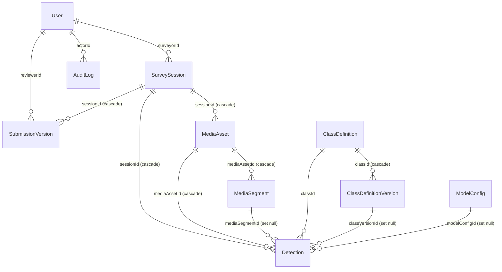

# Model Data

Sumber kebenaran: [`web/prisma/schema.prisma`](../web/prisma/schema.prisma). Migrasi di `web/prisma/migrations/` (`20260821145755_init_supabase_schema`, `20260919000000_add_sam_prompt`, `20260919010000_add_model_sam_mode`). Database: PostgreSQL (Supabase).

## 1. Diagram relasi

`AuditLog` mengacu ke entitas apa pun lewat pasangan `entityType` + `entityId` (tanpa foreign key).

## 2. Tabel

### User

| Field | Tipe | Keterangan |
|---|---|---|
| `id` | uuid | PK |
| `email` | string, unik | Dipakai untuk login |
| `name` | string | |
| `passwordHash` | string | bcrypt (cost 10) |
| `role` | string | `surveyor` (default) \| `admin` |
| `isActive` | boolean | User nonaktif tidak dapat login dan sesinya ditolak |
| `createdAt`, `updatedAt` | datetime | |

### ClassDefinition

| Field | Tipe | Keterangan |
|---|---|---|
| `id` | uuid | PK |
| `name` | string, unik | Slug (mis. `jalan_berlubang`) |
| `displayName` | string | Nama tampilan |
| `visualDescription` | string | Masuk prompt VLM |
| `conditionCriteria` | string | Masuk prompt VLM |
| `feasibilityCriteria` | string | Masuk prompt VLM |
| `isActive` | boolean | Kelas nonaktif tidak ikut pemrosesan baru |
| `mutuallyExclusiveWith` | string (JSON array id kelas) | Default `[]`. Belum ada UI |
| `conflictIouThreshold` | float | Default `0.5`. Belum ada UI |
| `samPrompt` | string? | Frasa bahasa Inggris untuk SAM3. Kelas tanpa nilai ini diabaikan oleh SAM3 |
| `samColor` | string? | `#RRGGBB` untuk overlay SAM3 |

### ClassDefinitionVersion

Snapshot kelas setiap dibuat/diubah (`versionNumber` naik satu per perubahan). `snapshotData` = JSON field kelas saat itu (termasuk `samPrompt`, `samColor`).

### ModelConfig

| Field | Tipe | Keterangan |
|---|---|---|
| `name` | string | Nama konfigurasi |
| `provider` | string | `OpenRouter` (default) \| `onpremise` \| `sam3` |
| `modelName` | string | Default `qwen/qwen3-vl-8b-instruct` |
| `endpointUrl` | string? | Untuk on-premise / endpoint kustom |
| `encryptedApiKey` | string? | AES-256-CBC; tidak pernah dikembalikan penuh oleh API |
| `samMode` | string? | Khusus `sam3`: `optimized` (default) \| `fast` |
| `isDefault`, `isActive` | boolean | Satu default aktif dipakai pemrosesan |

Model yang sudah dirujuk `Detection` tidak di-hard-delete, hanya `isActive=false, isDefault=false`.

### SurveySession

| Field | Tipe | Keterangan |
|---|---|---|
| `name` | string | |
| `locationType` | string | `point` (default) \| `polygon` |
| `locationGeojson` | string | GeoJSON sebagai teks |
| `locationAddress` | string? | Hasil pencarian/reverse geocode |
| `surveyDate` | datetime | |
| `startedAt` | datetime | Otomatis saat dibuat |
| `finishedAt` | datetime? | Diisi saat `Akhiri Survei` |
| `status` | string | `berlangsung` (default), `selesai_menunggu_submit`, `menunggu_review`, `disetujui`, `ditolak`, `perlu_perbaikan` |
| `surveyorId` | uuid | Pemilik |

### MediaAsset

| Field | Tipe | Keterangan |
|---|---|---|
| `sessionId` | uuid | Cascade hapus |
| `fileName` | string | Nama file asli |
| `fileType` | string | `image` \| `video` |
| `fileUrl` | string | URL publik bucket |
| `storagePath` | string | Path objek di bucket |
| `durationSeconds` | float? | Durasi video hasil ukur ffprobe (maks 20 menit) |
| `status` | string | `queued`, `uploading`, `uploaded`, `processing`, `completed`, `failed`, `deleted` (default `queued`; alur upload menulis `uploaded`) |
| `errorMessage` | string? | Pesan gagal proses |
| `idempotencyKey` | string?, unik | UUID acak per upload |

### MediaSegment

`segmentIndex`, `startTime`, `endTime`, `mediaUrl` (untuk SAM3 video: URL video anotasi), `status` (`pending|processing|completed|failed`), `extractionMetadata` (JSON string; untuk SAM3 memuat ringkasan hasil: fps, instance, puncak per kelas, prompt, `finding_conf`, `annotated_url`).

### Detection

| Field | Keterangan |
|---|---|
| `sessionId`, `mediaAssetId`, `mediaSegmentId?` | Jejak ke sumber. Hapus media/sesi menghapus detection (cascade). Segmen menjadi `null` jika dihapus |
| `classId`, `classVersionId?`, `className` | Kelas saat deteksi; `className` adalah salinan nama |
| `bbox` | JSON string `{x,y,width,height}` normalized 0–1 |
| `condition` | Deskripsi kondisi (VLM) atau ringkasan otomatis (SAM3) |
| `feasibility` | `layak` \| `cukup_layak` \| `tidak_layak` |
| `timestampSeconds?`, `frameIndex?` | Untuk sumber video |
| `locationGeojson?` | Salinan lokasi sesi |
| `modelConfigId?`, `modelName?`, `promptVersion?` | Jejak model. `promptVersion` = `v1.0` (VLM) atau `sam3` |
| `hasConflict`, `conflictResolved`, `conflictDetails` | Status konflik dan detail (JSON: id dan kelas yang bertabrakan, IoU, alasan) |
| `isDeleted` | Penanda hapus lunak (query aplikasi memfilter `isDeleted=false`) |

### SubmissionVersion

| Field | Keterangan |
|---|---|
| `sessionId`, `versionNumber` | Nomor versi naik per sesi |
| `status` | `menunggu_review` (default) \| `disetujui` \| `ditolak` |
| `snapshotData` | JSON snapshot lengkap saat submit: sesi, media, detection. Tidak diubah setelah dibuat |
| `rejectReason`, `reviewNotes` | Alasan dan catatan admin |
| `reviewerId?`, `reviewedAt?`, `submittedAt` | Jejak review |

### AuditLog

`action`, `entityType`, `entityId`, `actorId?`, `changes` (JSON string: nilai lama/baru dan `actionDescription`), `createdAt`.

Nilai `action` yang dipakai kode saat ini (tidak eksklusif): `SURVEYOR_UPLOAD_MEDIA`, `SURVEYOR_DELETE_MEDIA`, `UPDATE_SESSION_METADATA`, `SURVEYOR_END_SESSION`, `SURVEYOR_SUBMIT_SURVEY`, `SURVEYOR_START_REVISION`, `SURVEYOR_RESUBMIT_REVISION`, `SURVEYOR_EDIT_DETECTION`, `ADMIN_CORRECT_DETECTION`, `CORRECT_DETECTION`, `RESOLVE_CONFLICT`, `APPROVE_SURVEY`, `REJECT_SURVEY`, serta aksi manajemen user/kelas/model.

## 3. Format JSON yang disimpan sebagai teks

| Field | Bentuk |
|---|---|
| `Detection.bbox` | `{"x":0.12,"y":0.34,"width":0.25,"height":0.18}` |
| `Detection.conflictDetails` | `{}` atau rincian konflik: `conflicting_with_class`, `conflicting_with_id`, `iou`, `reason`; untuk video SAM3 juga `conflict_frame_index`, `conflict_timestamp_seconds` |
| `ClassDefinition.mutuallyExclusiveWith` | `["<classId>", ...]` |
| `SurveySession.locationGeojson` | GeoJSON `Point` atau `Polygon` |
| `SubmissionVersion.snapshotData` | Objek: `versionNumber`, data sesi, daftar media (id, nama, tipe, URL, status), daftar detection, ringkasan |
| `MediaSegment.extractionMetadata` | Bebas per provider |

## 4. Aturan integritas yang ditegakkan aplikasi

- Transisi status hanya lewat `state-machine.ts`.
- Media dan detection dihapus permanen saat surveyor menghapus media; objek di bucket ikut dihapus.
- Sesi yang sudah punya `SubmissionVersion` tidak dapat dihapus.
- Kelas dan model yang sudah dirujuk data historis hanya dinonaktifkan.
- `Detection` diproses ulang dengan strategi hapus-lalu-tulis dalam transaksi, sehingga tidak ada duplikat.

## 5. Data awal (seed)

| Perintah | Isi |
|---|---|
| `npm run seed` (`prisma/seed.ts`) | Akun admin dan surveyor awal, kelas awal (`jalan_berlubang`, `rambu_rusak`, `marka_pudar`, `lampu_padam`, `trotoar_rusak`) beserta versi 1, model default Qwen3 VL 8B (OpenRouter, tanpa API key) |
| `npm run seed:sam3` (`prisma/seed-sam3.ts`) | Mengisi `samPrompt`/`samColor` pada kelas yang ada (tidak menimpa hasil edit admin), menambah kelas `manhole`, membuat konfigurasi model SAM3 dan menjadikannya default. Aman dijalankan berulang |

Kredensial akun seed tidak dicantumkan di dokumentasi; lihat `prisma/seed.ts` dan **ganti password segera di lingkungan bersama atau produksi**.
